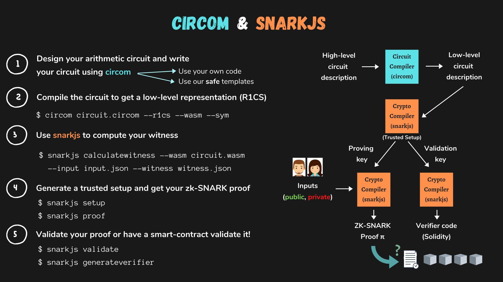

# circom の基礎

このセクションでは、 [Tornado Cats の circom についての章](https://minaminao.github.io/tornado-cats/circuit/)を読み進めながら、いくつかの資料や演習を追加で確認していきます。

## 1. circom の概要

Tornado Cats の[ゼロ知識証明の回路の基礎](https://minaminao.github.io/tornado-cats/circuit/)と [Circom とは](https://minaminao.github.io/tornado-cats/circuit/circom/)を読んでください。

## 2. 環境構築

circom を利用するためには、主に circom コンパイラ本体と、証明生成・検証のためのライブラリをセットアップする必要があります。

circom のための証明生成・検証のためのライブラリは、複数の選択肢の中から選ぶことができます。例えば、JavaScript ベースのブラウザ実行も容易な `snarkjs` や、C++ で書かれており、より高速な証明生成が可能な `rapidsnark` などがあります。このチュートリアルでは、主に `snarkjs` を利用して学習を進めます。

**1. circom の install**

Circom 2 Documantation の [Installation](https://docs.circom.io/getting-started/installation/) を参考に circom をインストールしてください。

circom には rust が必要なことに注意してください。

**2. snarkjs の install**

[snarkjs の GitHub の README](https://github.com/iden3/snarkjs) を参考に snarkjs をインストールしてください。

snarkjs には node.js の v18 以上が必要なことに注意してください。

**3. git clone**

この GitHub のリポジトリをローカルに `git clone` してください。もし、まだ環境構築が完了していない場合には、 GitHub Codespaces というクラウド環境で動かしてください。

GitHub Codespaces を使用する場合は、「<> Code 」ボタンを押した後 Codespaces タブに移動して、「 Create codespace on main 」ボタンを押してください。

環境が整ったら、Tornado Cats の 以下のページを読みながら、ご自身のローカル環境または Codespaces 上で一つずつ実際に手を動かしてみてください。
また、その際の作業ディレクトリは、 `/tornado-cats` になります。
事前に `cd` コマンドで移動してください。

## 3. circom を用いたゼロ知識証明の全体像

### 3.1 コンパイルから検証までの流れを俯瞰する



*画像引用元: [Circom 2 Documentation - Visual summary](https://docs.circom.io/#visual-summary)*

**1. 回路の例:因数分解**

[回路の例:因数分解（Tornado Cats）](https://minaminao.github.io/tornado-cats/circuit/factorization/)

**2. 回路のコンパイル**

[回路のコンパイル（Tornado Cats）](https://minaminao.github.io/tornado-cats/circuit/compile/)

circom コマンドによるコンパイルのより詳しい各オプションの説明は、Circom 2 Documentation の [Compiling our circuit](https://docs.circom.io/getting-started/compiling-circuits/) を参照してください。

**3. Rank 1 Constraint System**

[Rank 1 Constraint System（Tornado Cats）](https://minaminao.github.io/tornado-cats/circuit/r1cs/)

今回試作している回路の R1CS の情報を出力するコマンドは以下になります。
```bash
snarkjs r1cs info multiplier2.r1cs
```

**4. ウィットネスの計算**

[ウィットネスの計算（Tornado Cats）](https://minaminao.github.io/tornado-cats/circuit/witness-computation/)

**5. ゼロ知識証明のセットアップ**

[ゼロ知識証明のセットアップ（Tornado Cats）](https://minaminao.github.io/tornado-cats/circuit/setup-zkp/)

snarkjs によるセットアップのより詳しい説明は、snarkjs の GitHub の README の [Guide](https://github.com/iden3/snarkjs/blob/master/README.md#guide) を参照してください。

**6. ゼロ知識証明の生成と検証**

[ゼロ知識証明の生成と検証（Tornado Cats）](https://minaminao.github.io/tornado-cats/circuit/generation-and-verification/)

**7. スマートコントラクトからの検証**

Tornado Cats には記載がありませんでしたが、 snarkjs で検証をスマートコントラクト上で行うための Solidity の関数とファイルを生成することができます。

```bash
snarkjs zkey export solidityverifier multiplier2_0001.zkey verifier.sol
```

コマンドで指定した検証キー（ .zkey ファイル）から、 verifer.sol という Solidity のファイルを出力します。
このスマートコントラクトをデプロイすることで、外部のスマートコントラクトから関数を実行することで、ゼロ知識証明の検証を行うことができます。

このオンチェーン検証は、Tornado Cashを始めとする多くのzk-SNARKsを活用したアプリケーションで採用されている重要な技術です。スマートコントラクト上で証明を検証することにより、特定の情報を秘匿したまま計算の正当性のみをブロックチェーンに記録することができます。これにより、プライバシーを保護しつつ、信頼性の高いトランザクションを実現することが可能になります。

クライアント上でユーザーが入力した値から証明を作成する方法は、circom 2 Documentation の [Verifying from a Smart Contract](https://docs.circom.io/getting-started/proving-circuits/#verifying-from-a-smart-contract) snarkjs の GitHub の README の [25. Turn the verifier into a smart contract](https://github.com/iden3/snarkjs?tab=readme-ov-file#25-turn-the-verifier-into-a-smart-contract) 以降の項目を参照してください。

この Solidity Verifier については、後ほど実装演習で触れることになります。

## 4. circom 言語の基本

circom には、大きく分けて2つの役割があります。

- 制約
  - 回路の R1CS 制約のリストの作成
- 計算
  - 入力値から witness と 出力値 を計算する（ためのコードの生成）

この2つの役割を同時にコーディングすることが、利便性と後述する特有の制限に繋がっています。

### 4.1 template
circom では、回路は `template` を使って定義し、制約を生成します。

前述のとおり、`component` を使用してインスタンス化します。

以下のように使用できます。

```circom
template CheckIsEqual() {
  signal input a;
  signal input b;
  signal output c;

  component eq = IsEqual();  // 外部の template
  eq.in[0] <== a;  // 入力値１
  eq.in[1] <== b;  // 入力値２
  c <== eq.out;  // 出力値
}
```

### 4.2 インクルード

`include` : 外部のテンプレートをインポートする。

### 4.3 変数の宣言

変数の宣言には、 `signal` と `var` と `component` があります。

**signal** : 制約と計算のための変数

signal は、 以下の3種類があります。

- `signal input` : template への入力値を受け取る変数
- `signal output` : template からの出力値を返す変数
- `signal` : template 内で任意に宣言する制約と計算のための変数定義

これらは制約と計算のための変数で、回路をコンパイルして制約を作成する際に、template 外の未知の値を定義するために使用します。

そのため、signal は再代入等の動的な変更はできません。

**var** : 計算のための変数

計算のための変数で、制約は生成されません。

そのため、var は再代入等の動的な変更が可能です。

一般的なプログラミング言語の変数宣言と同様のものと考えることができ、ループのインデックスの等によく使用されます。

**component** : template のインスタンス化のための変数

外部の template をインスタンス化し、現在の template 内で使用します。

また、 main コンポーネントを定義するときに、 public に指定することで秘匿化しない入力値を定義することができます。
それ以外の入力値は全て自動的に private に設定されます。

```circom
template Multiplier(){
    signal input in1;
    signal input in2;
    signal output out;
    out <== in1 * in2;
}

// main コンポーネントで signal input in1 を公開入力に指定
component main {public [in1]} = Multiplier();
```

### 4.4 代入演算子

**`<==`** : 制約と計算の両方を同時に行う代入演算子です。具体的には、代入と共に、両辺が等しいという制約を追加します。

基本的に、こちらを使用することが推奨されています。

**`<--`** : signal に対して計算のための代入のみを行う代入演算子です。制約を追加する必要がない場合や、後で制約を別途追加する場合に使用します。

**`===`** : 制約のみを追加する代入演算子です。 `<--` で一時的な計算を行った後に、計算に対して制約を追加する場合に使用します。

**`=`** : var に対して計算のための代入のみを行う代入演算子です。

つまり、以下の2つのコードは同等です。

```circom
template Multiply() {
    signal input a;
    signal input b;
    signal output c;
    
    c <-- a * b;
    c === a * b;
}

template MultiplySame() {
    signal input a;
    signal input b;
    signal output c;
    
    c <== a * b;
}
```

### 4.5 function
circom の `function` は、計算を実行するために使用されます。`template` とは異なり、回路の制約を生成しません。

`function` は `signal` ではなく `var` 変数に対して操作を行います。

以下は `function` の例です。

この例では、`x` の値に応じて異なる値を返す関数を定義しています。circom では、関数内の制御フローの全てのパスに `return` 文が必要なため、最後に `return 42;` を追加して、すべての条件に対応しています。

```circom
function f(x) {
  if (x==0) {
    return 1;
  } else if (x==1) {
    return 0;
  }
  return 42; // その他のケースに対応する return 文が必要
}
```

### 4.6 基本演算子

circom にはブール演算子、算術演算子、ビット演算子があります。
これらは一般的なプログラミング言語と同様の動作をしますが、 算術演算子は p を法とする数値として動作することに注意してください。

具体的な基本演算子については、Circom 2 Documentation の [Basic Operators](https://docs.circom.io/circom-language/basic-operators/) を参照してください。

## 5. コーディングにおける circom 特有の制限

### 5.1 signal と 配列

コンパイル時に配列のサイズを定数で確定させる必要があるため、`array[signal_value]` のように signal の値を用いた配列の初期化はできません。signal の値を用いて配列のサイズを指定してしまうと、未知の値によって回路の構造が動的に変わることになってしまうためです。

### 5.2 分岐とループ

circom の回路は、コンパイル時にその構造が静的に決定されます。そのため、証明生成時まで値が確定しない `signal` を、 `if` 文や `for` ループの条件式に直接使用して回路の制約を動的に変更することはできません。`signal` の値に依存する条件分岐を実装するには、`if` 文などの制御構文ではなく、算術的な制約に置き換える必要があります。

例えば `condition` という `signal` (値は0か1) によって `a` か `b` を選択する場合、以下のような算術式で表現します。

```circom
out <== condition * a + (1 - condition) * b;
```

これにより、`condition` が `1` なら `out` は `a` に、 `0` なら `b` と同等になり、条件分岐を実現できます。

このようなロジックは、後述する `circomlib` のテンプレート（ Mux1 等）を利用すると、より簡単に実装できます。

また、ループ内では、新たな `signal` や `component` を宣言することはできません。

ループの外でまとめて配列として宣言しておくことで、ループ内で代入やインスタンス化に使用できます。

```circom
signal a[10];
component isZeros[10];

for (var i = 0; i < 10; i++) {
  isZeros[i] = IsZero();
  isZeros[i].in <== a[i];
}
```

### 5.3 その他の制限

他の制限事項についても確認してみたい方は、[Circom 2 Documentation](https://docs.circom.io/) の The circom language を参照してください。

## 6. circomlib の活用

circomlib は、よく使われる回路パターンをテンプレートとして提供するライブラリです。分岐やループを含む複雑な処理を、より簡単に記述できます。

### 6.1 circomlib のインストール

circomlibは npm パッケージとして提供されているため、プロジェクトのディレクトリで以下のコマンドを実行してインストールします。

`over20` ディレクトリに移動し、npm または yarn を使用して、 circomlib をディレクトリ内にローカルインストールしてください。

**npm の場合**
```bash
npm init -y
```
```bash
npm install circomlib
```

**yarn の場合**
```bash
yarn init -y
```
```bash
yarn add circomlib
```

circom内 の `include` 文でプロジェクトの `node_modules` ディレクトリから circomlib を探すためにパスを記述する必要があります。

```circom
include "node_modules/circomlib/circuits/comparators.circom";
```

これで circomlib のテンプレートを使用する準備が整いました。
over20.circom で、circomlib を使用してコンパイルしてみてください。
また、余裕があれば気になるテンプレートを試してください。

### 6.2 主要なテンプレート

#### ビット変換（Bit Operations）
- `Num2Bits(n)`: 数値を n ビットの配列に変換
- `Bits2Num(n)`: n ビットの配列を数値に変換

#### 比較器（Comparators）

circomlib が提供する比較器は、主に等価性をチェックするものと、大小関係を比較するものの2種類に大別できます。

等価比較
- `IsZero()`: 入力が 0 かどうかをチェック
- `IsEqual()`: 2つの入力が等しいかをチェック

大小比較

circom が扱う数値は素数 p を法とする有限体上の要素であるため、単純な大小比較は意図通りに機能しません。安全に大小を比較するためには、比較対象の数値が p よりも小さいことを保証した上で、工夫する必要があります。
circomlib の比較器では、比較したい数値が最大で何ビットの大きさなのかを引数 `n` で指定し、その範囲内で計算を行うことで、大小関係を正しく比較しています。

- `LessThan(n)`: 2つの入力を比較して in[0] < in[1] かをチェック
- `LessEqThan(n)`: 2つの入力を比較して in[0] <= in[1] かをチェック
- `GreaterThan(n)`: 2つの入力を比較して in[0] > in[1] かをチェック
- `GreaterEqThan(n)`: 2つの入力を比較して in[0] >= in[1] かをチェック

#### 論理ゲート（Logical Gates）
`circomlib`には、ブール代数の基本的な論理ゲートを実装したテンプレートも用意されています。入力は`0`または`1`のバイナリ値を想定しています。

- `AND()`: 論理積
- `OR()`: 論理和
- `NOT()`: 否定

#### マルチプレクサ（Mux1 & Mux2）
- `Mux1()`: 条件信号 `s` が 0 なら入力 `c[0]` を、1 なら `c[1]` を選択して出力します。
- `Mux2()`: 2ビットの条件信号 `s` の値 (0〜3) に応じて、4つの入力 `c[0]`〜`c[3]` から1つを選択します

### circomlibjs

`circomlibjs` は、 `circomlib` の回路の witness を計算するための JavaScript ライブラリです。主に `circomlib` の回路をテストする際に使用されます。詳細については、[circomlibjs の GitHub リポジトリ](https://github.com/iden3/circomlibjs) を参照してください。

## 7. 練習問題

### 1. 3個の入力シグナルを持つ乗算器

3つの入力値を掛けた値が定義された出力値と同値になるかどうかの制約を計算する回路を `multiplier3` ディレクトリに実装してください。

余裕がある場合には、 circomlib を使用して実装してみてください。

### 2. FizzBuzz

FizzBuzz は、3 で割り切れる場合に Fizz と表示し、5 で割り切れる場合に Buzz と表示し、両方で割り切れる場合に FizzBuzz と表示するプログラムです。

fizzbuzz ディレクトリに実装してください。

数字の配列の長さは 15 に固定して（ `array[15]` ）、 input.json ファイルに保存してあります。

ターミナルに値を出力するには、circom ファイル内で `log` 関数を使用し、ターミナルでウィットネスを計算するファイル（ generate_witness.js ）を実行します。

```circom
log(value);
```

また、通常のプログラミング言語の `%` 演算子に類似した剰余演算のために、 `DivRem` テンプレートを fizzbuzz.circom 内に用意しましたので、必要に応じて使ってください。

余裕がある場合には、元の配列の値を以下のように計算して、 `out[15]` に出力してください。
- 3 で割り切れる場合、3333 に置き換える
- 5 で割り切れる場合、5555 に置き換える
- 15 で割り切れる場合、1515 に置き換える
- それ以外の場合、元の値をそのまま出力する

この部分まで実装すると、ある入力配列の各要素に対して、FizzBuzzのルール（3で割り切れる、5で割り切れる、15で割り切れる）に従った判定と変換が正しく行われていることを証明する回路が完成します。

### 3. （オプション）ZKU Week2 の課題

さらに余裕がある方は、ZKU Week 2 Assignment の「 Part 1 Hashes and Merkle Tree 」の 課題 2 と 3 を解いてみてください。（ Part 2 の Tornado Cash は別途実装演習があるため、スキップしてください。）

ページに遷移したら、Log in ではなく、 Access as a guest ボタンを押してください。

[ZKU Week 2 Assignment](https://zku.gnomio.com/mod/assign/view.php?id=119)


## 8. 参考資料

### 公式ドキュメント
-   [Circom 2 Documentation](https://docs.circom.io/)

### 基礎学習向け
- [Tornado Cats](https://minaminao.github.io/tornado-cats/)
- [circom101](https://circom.erhant.me/)
- [Circom language tutorial with circomlib walkthrough](https://www.rareskills.io/post/circom-tutorial)

### 実践的な内容
- [core-program](https://github.com/ethereum/zket-core-program)
- [learn.0xparc.org](https://learn.0xparc.org/)
- [zkhack](https://zkhack.dev/)
- [ZKU](https://zku.gnomio.com/course/view.php?id=8)

### ライブラリ・ツール
- [circomlib](https://github.com/iden3/circomlib)
- [circomlibjs](https://github.com/iden3/circomlibjs)
- [snarkjs](https://github.com/iden3/snarkjs)
- [zkrepl.dev](https://zkrepl.dev/)  （オンラインで circom を気軽に試せるプレイグラウンド）
- [circom tester](https://github.com/iden3/circom_tester) （circom のテスト関連ツール）
- [circomkit](https://github.com/erhant/circomkit) （circom のテスト関連ツール）